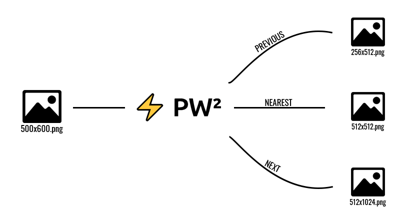

# ⚡ PW²

<p align="center">
  
</p>

<p align="center">A library that easily allows you to re-scale your images to the right power of two dimensions.</p>

## Installation

```bash
npm i pw2
```

## Backend Usage
Combine ⚡PW² with ```fs``` and resize your textures with only 8 lines of code.
```js
const fs = require('fs')
const {createPw2, RESIZING_MODES} = require('pw2')
const  pw2 = createPw2()
 
async function main(inputPath) {
	const inputFile = await fs.readFileSync(inputPath)
	const nearestBuffer = await pw2.resizeAndGetBuffer(inputFile, RESIZING_MODES.NEAREST_PW2)
	fs.writeFileSync('./nearest.png', nearestBuffer)
}
```

## FrontEnd Usage
Hook the ```handleFileUpload``` function to your file input 'change' event, and use ```file-saver``` to download the blob easilly.
```js
import {saveAs} from 'file-saver'
import {createPw2, RESIZING_MODES} from 'pw2'
const  pw2 = createPw2()

async function handleFileUpload(evt) {
	const file = evt.target.files[0]
	const fileReader = new  FileReader()

	fileReader.onload = async() => {
		const resizedFile = await pw2.resizeAndGetBuffer(fileReader.result, RESIZING_MODES.NEAREST_PW2)
		const resizedFileBlob = new Blob([resizedFile])
		saveAs(resizedFileBlob, 'resized_image.png')
	}

	fileReader.readAsArrayBuffer(file)
}
```

## But Why ?

Games and real-time applications, in general, tend to prefer images and textures with power-of-two dimensions, because they make it easier to generate mipmaps, consume less GPU memory, and increase the overall performance for shader operations.

However, finding the right power-of-two values for each dimension of each texture of each model in your application sounds time-consuming, and it is. [⚡PW²](https://www.npmjs.com/package/pw2) born from the necessity to make this a no-brainer, quick and easy process.

⚡PW² uses [Jimp](https://github.com/oliver-moran/jimp/) under the hood to get your texture current dimensions and re-scale it to the right power-of-two dimensions.

This library was developed for the cs50 Final Project assignment.

## License

[MIT](https://github.com/jordyhenry/pw2/blob/master/LICENSE)

## TODO
- Fix PREVIOUS_PW2 enum value to PREVIOUS_PW2 on [src/resizingModes.ts](https://github.com/jordyhenry/pw2/blob/master/src/resizingModes.ts#L3)
- Fix Ipw2 Interface methods to accept Pw2AllowedInputs as type to file input on [src/pw2.ts](https://github.com/jordyhenry/pw2/blob/master/src/pw2.ts#L10-L15)
- Export Ipw2 Interface to external use on [src/pw2.ts](https://github.com/jordyhenry/pw2/blob/master/src/pw2.ts#L12-L15) and [src/index.ts](https://github.com/jordyhenry/pw2/blob/master/src/index.ts)
- Fix any English misspells (sorry guys, it's not my first language  🤷‍♂️)